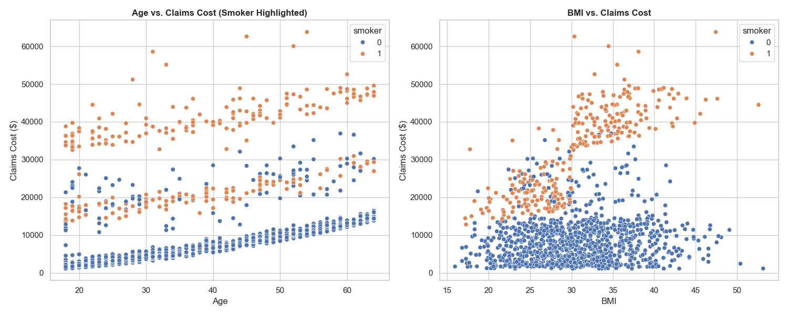
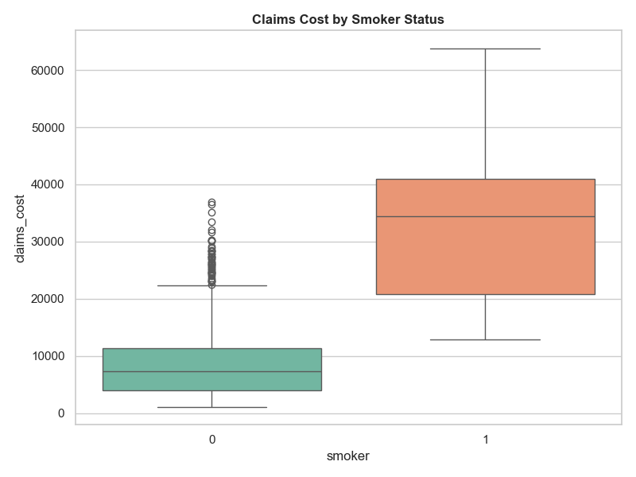
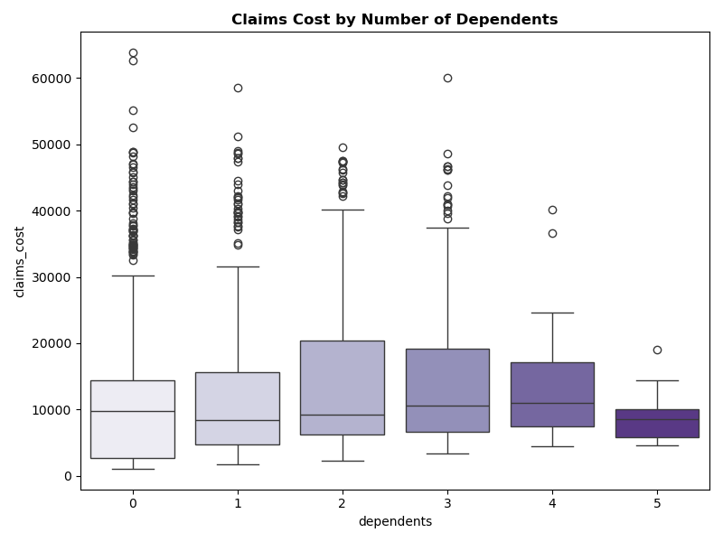
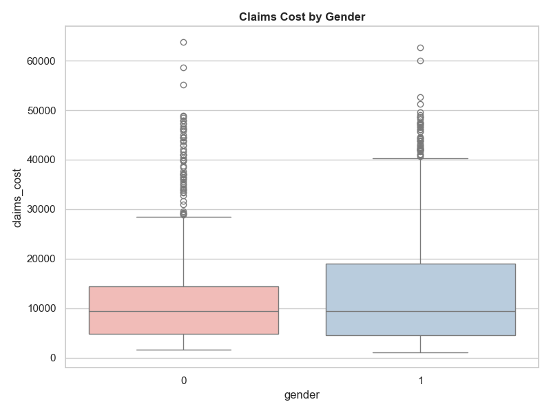
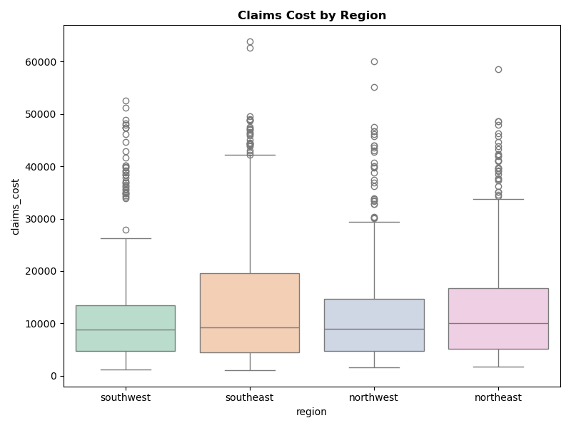
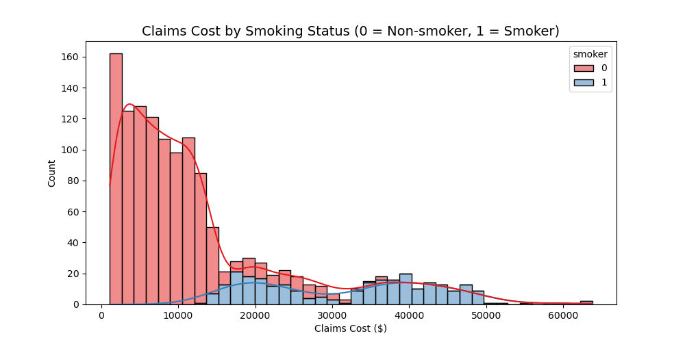
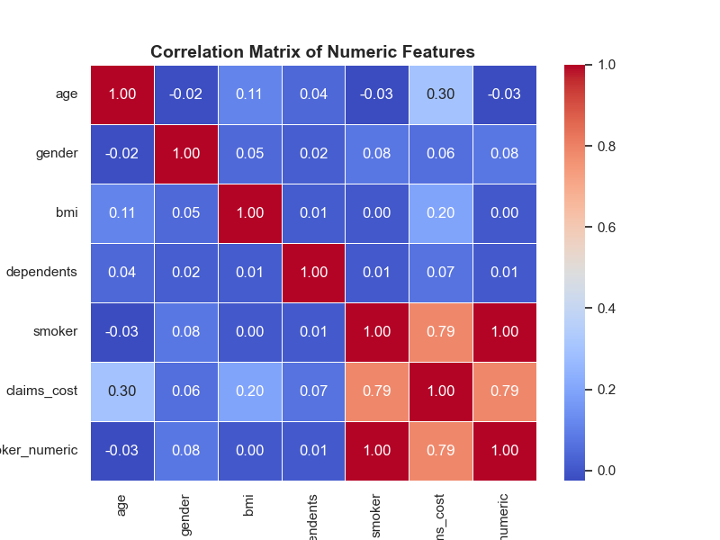
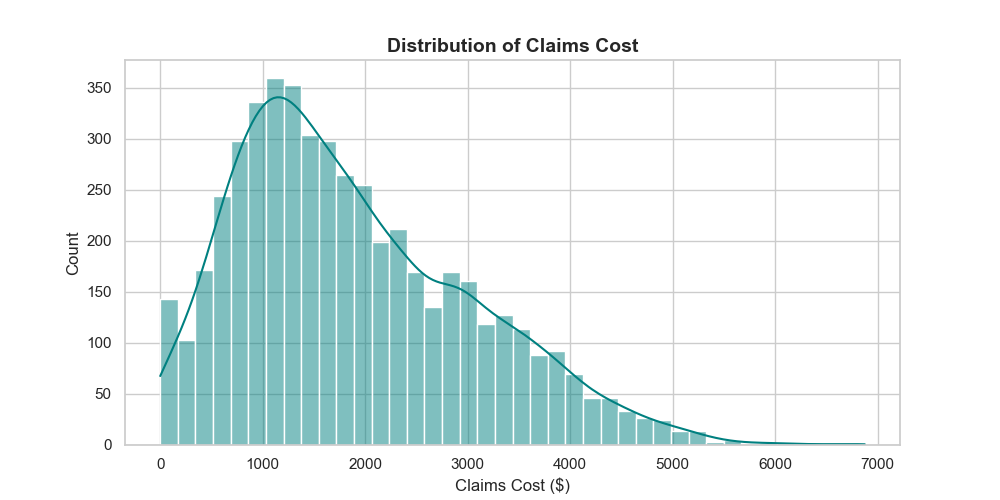
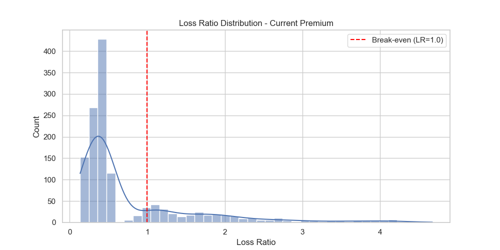
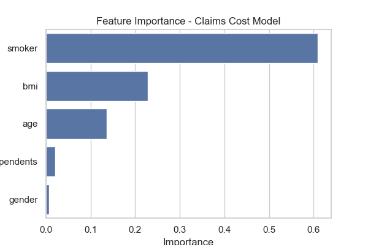

# Health Insurance Claims
Health Insurance Underwriting with Simulated Health Insurance Dataset

[Notebook Link](https://github.com/Sodiq-Shodimu/nexygen-project/blob/main/health-insurance-claims.ipynb)  

---

## Table of Contents

- [Overview](#overview)  
- [Dataset](#dataset)  
- [Technologies Used](#technologies-used)  
- [Installation](#installation)  
- [Usage](#usage)  
- [Analysis & Visualizations](#analysis--visualizations)  
- [Conclusion](#conclusion)  
- [Credits](#credits)  
- [License](#license)  

---

## Overview

- The dataset was chosen to assess heath insurance uderwriting. 
-The objecive was to determine segmentation, risk scoring, data insights and  scenario testing

---

## Dataset
- The dataset is Medical Cost Personal Datasets from Kaggle
- Size of the dataset is 1338 rows and 7 columns  

---

<h2>Technologies Used</h2>

<ul>
  <li><strong>Languages & Libraries:</strong> Python, Pandas, NumPy, Matplotlib, Seaborn, sklearn</li>
  <li><strong>Tools:</strong> Jupyter Notebook, VS Code, Git, GitHub</li>
 
</ul>

<p>
  
  
  
  
  
  
</p>

<P>
  
    
  
  
</p>
<p>
  
</p>

---

## Installation

Step-by-step instructions to set up the project locally:

```bash

# Clone the repository
git clone git clone https://github.com/Kurodataio/Health-Insurance-Claims.git

# Navigate to the project folder
cd Health-Insurance-Claims

# Launch Jupyter Notebook
jupyter notebook


```

## Usage

Instructions for using the project:

1. Open the main notebook (`health-insurance-claims.ipynb`)  
2. Run ALL cells or each cell sequentially to reproduce the analysis  
3. Visualizations and results will be generated automatically  

---

## Analysis & Visualizations 

- **Age vs. Claims Cost (Smoker Highlighted)**
  - 3 clear bands with linear relationship between age and claims cost
  - Bottom blue non-smokers band has lowest age to claims cost
  - Middle non-smokers and smokers
  - Top orange smokers band has the gighest agr to claims cost
  - The is a clear positive linear relationship between age and claims cost
  - Smoking increases the cost of caims
- **BMI vs. Claims Cost**
  - For non-smokers BMI is minor impact on costs. Most claims costs for non smokers are below $15k
  - For smokers, there is significant BMI impact beyond BMI of 30
  - BMI minimal impact on claims costs for non-smokers however for BMI over 30 there is an sudden and increasing impact on costs
 

- **Claims Cost by Smoker Status**
  - The average claims cost between smokers and non-smokers claims cost is significant
  - Non-smokers have a median cost of $7,500
  - Smokers have a mediam cost of $34,500
  - There is no overlap between the smoking and non-smoking groups
  - The 75th percentile for non-snokers is lower than the 25th percentile for smokers
  - For non smokers teh claims cost are between $4,000 and $11,500
  - For smokers teh claims cost are between $21,000 to $41,000
  - Smokers have a wider range (variance) of claims costs
  - Non smokers have many outlying claims around $23,000 up to $37,000
  - This plot shows high outliers for non-smokers are within the typical claims cost for smokers


- **Claims Cost by Dependents**
  - The average (median) claims cost for all groups is $8,000 and $11,000
  - 0 to 2 dependents: The median is around $8,500–$9,500
  - 3 to 4 dependents: The mdian peaks at $11,000 for 4 dependents
  - 5 dependents: The median is under $9,000
  - The group with 0 dependents has outliers with the highest cost of $60,000+
  - The group with 5 dependents has outliers with the lowest cost at under $20,000
  - The number of dependents does not dictate high claims cost. In fact it seems the opposite.
 

- **Claims Cost by Gender**
  - Both genders have an average clam cost of $9,300.
  - Gender has no significance to median claim costs
  - Both genders have a long tail of outliers. Beyond $20K for Women and beyond $40k for men
 

- **Claims Cost by Region**
 

- **Claims_Cost_Distribution_by_Smoking_Status**
 

- **Correlation_Heatmap**
 

- **Distribution_of_Claims_Cost**
 

-**Loss_Ratio_Distribution**
 

- **Feature_Importance**
 
<!--   -->
<!--   -->

---

## Conclusion 
- Summarize the outcome of your analysis  
- What are the main insights or takeaways?  
- How could this analysis inform decision-making?  
- Recommendations or next steps for further analysis  
- **Smoking and BMI combined are associated with the highest claims cost**
- **Are smoking and BMI signals for increased billing or actual indicators of assocated illness?**

---

## Credits

- **Dataset Source:** [Kaggle → Datasets](https://www.kaggle.com/datasets/mirichoi0218/insurance)  
- **Google Gemini** [Link](https://gemini.google.com/app)  
- **CoPilot** [Link](https://copilot.microsoft.com/)  

---

## License

This project is licensed under the [MIT License](https://choosealicense.com/licenses/mit/)

---
