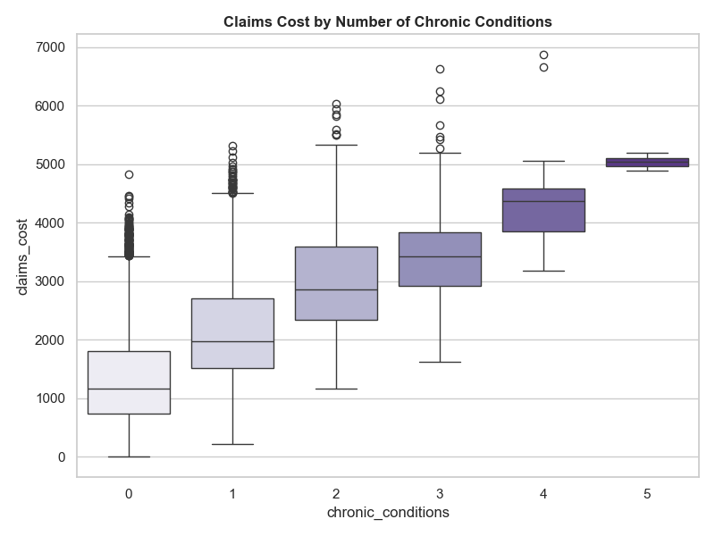

# Health Insurance Claims
Health Insurance Underwriting with Simulated Health Insurance Dataset

[Notebook Link](https://github.com/Sodiq-Shodimu/nexygen-project/blob/main/health-insurance-claims.ipynb)  

---

## Table of Contents

- [Overview](#overview)  
- [Dataset](#dataset)  
- [Technologies Used](#technologies-used)  
- [Installation](#installation)  
- [Usage](#usage)  
- [Analysis & Visualizations](#analysis--visualizations)  
- [Conclusion](#conclusion)  
- [Credits](#credits)  
- [License](#license)  

---

## Overview

- The dataset was chosen to assess heath insurance uderwriting. 
-The objecive was to determine segmentation, risk scoring, data insights and  scenario testing

---

## Dataset
- The dataset is Medical Cost Personal Datasets from Kaggle
- Size of the dataset is 1338 rows and 7 columns  

---

<h2>Technologies Used</h2>

<ul>
  <li><strong>Languages & Libraries:</strong> Python, Pandas, NumPy, Matplotlib, Seaborn, sklearn</li>
  <li><strong>Tools:</strong> Jupyter Notebook, VS Code, Git, GitHub</li>
 
</ul>

<p>
  
  
  
  
  
</p>

---

## Installation

Step-by-step instructions to set up the project locally:

```bash

# Clone the repository
git clone git clone https://github.com/Kurodataio/Health-Insurance-Claims.git

# Navigate to the project folder
cd Health-Insurance-Claims

# Launch Jupyter Notebook
jupyter notebook


```

## Usage

Instructions for using the project:

1. Open the main notebook (`health-insurance-claims.ipynb`)  
2. Run ALL cells or each cell sequentially to reproduce the analysis  
3. Visualizations and results will be generated automatically  

---

## Analysis & Visualizations 

- Describe the key trends and patterns you observed  
- Show charts, graphs, and tables 
 


<!--   -->
 
 
 


 
 
 
 
 
<!--   -->
<!--   -->

- Include important observations or correlations found in the data  

---

## Conclusion 

- Summarize the outcome of your analysis  
- What are the main insights or takeaways?  
- How could this analysis inform decision-making?  
- Recommendations or next steps for further analysis  

---

## Credits

- **Dataset Source:** [Kaggle → Datasets](https://www.kaggle.com/datasets/mirichoi0218/insurance)  
- **Google Gemini** [Link](https://gemini.google.com/app)  
- **CoPilot** [Link](https://copilot.microsoft.com/)  

---

## License

This project is licensed under the [MIT License](https://choosealicense.com/licenses/mit/)

---
